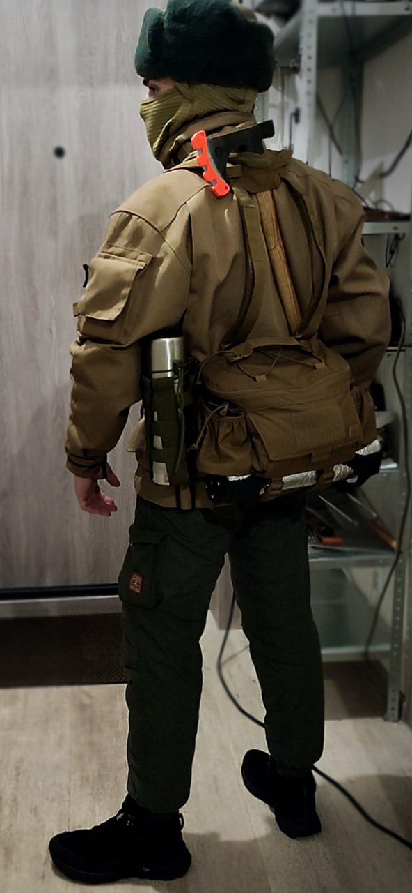

<b>Mail:</b> arsen@mirzaev.sexy 
<b>Telegram:</b> [@free_labubistan](https://t.me/free_labubistan) 
<b>Telegram journal:</b> [@from_mirzaev](https://t.me/from_mirzaev)&ensp;<small>(blog)</small> 

<b>[SVOBODA](https://svoboda.works)</b>&ensp;<b>[MIRZAEV](https://mirzaev.sexy)</b>&ensp;<b>[KODORVAN](https://kodorvan.tech)</b> 

2001 → 2012&emsp;<small>Дальний Восток</small>&emsp;<b>Хабаровск</b>&emsp;&emsp;&emsp;&emsp;&emsp;&emsp;&emsp;&emsp;&nbsp;&nbsp;<small>Far East, Khabarovsk</small> 
2012 → 2016&emsp;<small>Дальний Восток</small>&emsp;<b>Комсомольск на амуре</b>&emsp;&emsp;&nbsp;&nbsp;<small>Far East, Komsomolsk on amur</small> 
2016 → 2023&emsp;<small>Дальний Восток</small>&emsp;<b>Хабаровск</b>&emsp;&emsp;&emsp;&emsp;&emsp;&emsp;&emsp;&emsp;&nbsp;&nbsp;<small>Far East, Khabarovsk</small> 
2023 → 2025&emsp;<small>Сибирь</small>&emsp;&emsp;&emsp;&emsp;&thinsp;<b>Дистрибутив Мечтатели</b>&emsp;&emsp;<small>Siberia, Dreamers distribution</small> 
2025 → 2026&emsp;<small>Пермский край</small>&emsp;&nbsp;<b>Пермь</b>&emsp;&emsp;&emsp;&emsp;&emsp;&emsp;&emsp;&emsp;&emsp;&nbsp;&nbsp;&nbsp;&nbsp;&nbsp;<small>Permskiy kray, Perm</small> 

<b>Полное имя:</b> Арсен Мирзаев Татьяно-Мурадович 
<small><b>Full name:</b> Arsen Mirzaev Tatyano-Muradovich (he/him)</small>

 
<small>
<b>1:</b> 2025 autumn, Siberia, Dreamers distribution 
<b>2:</b> 2025.12.26, Perm
</small> 

## Для спецслужб РФ&emsp;<small><i>For Russian special forces</i></small>
Я уже успел познакомиться с <b>ЧВК Вагнер</b> (2023), <b>МВД</b> (2024) и <b>ФСБ</b> (2025), поэтому прилагаю текст ниже для всех спецслужб РФ: 
<small>I have already become familiar with the <b>Wagner PMC</b> (2023), the <b>Ministry of Internal Affairs</b> (2024), and the <b>Federal Security Service</b> (2025), so i am attaching the text below for all Russian special forces:</small>

* Не нарушаю законодательство России и не планирую его нарушать 
<small>I do not violate Russian law and do not plan to violate it</small> 
* Обо всём я упорно молчу. Работаю только с лицами имеющими гражданство Российской Федерации 
<small>I stubbornly remain silent about everything. I work only with individuals who hold Russian citizenship</small> 
* Все данные мной обещания я соблюдаю и возражений к ним не имею 
<small>I keep all the promises i made and have no objections to them</small> 
* Я никогда ни от кого не прятался и не прячусь сейчас, в открытом доступе можно найти геолокацию 
<small>I have never hidden from anyone and i am not hiding now, my geolocation is publicly available</small> 

<i>На меня периодически пишут доносы самые разные <b>ультраправые</b> активисты и <b>боевые псевдо-патриты</b>, поэтому я вынужден оставлять этот позорный раздел здесь.</i> <i>Не для того, чтобы возвысить себя над остальными, не для того чтобы повысить свою значимость таким нелепым методом - это отвратительная ситуация из-за которой я потерял миллионы рублей</i> 

<small><i>I am periodically denounced by various <b>ultraright</b> activist communities and <b>pseudo-patriots</b>, so i am forced to leave this shameful section here.</i></small> <small><i>Not to elevate myself above others, not to increase my importance with such a ridiculous method - this is a disgusting situation because of which I lost millions of rubles.</i></small>

<i>Моим друзьям, моим заказчикам и моим ученикам уже много лет пишут с угрозами и вымышленными обвинениями. Их запугивают и вербуют, был один случай развода на деньги. Помимо этого ФСБ подсылает провокаторов ко мне и моим друзьям, пытаясь заставить нас совершить преступление. Доказанных провокаторов на момент декабря 2025 года: <b>7 аккаунтов телеграм</b> и <b>4 аккаунта в дискорд</b>.</i> 

<small><i>My friends, my clients, and my students have been receiving threats and fabricated accusations for years. They are being intimidated and recruited; there was one case of fraud. Furthermore, the Federal Secure Service sends provocateurs to me and my friends, trying to coerce us into committing crimes. As of December 2025, the number of proven provocateurs: <b>7 Telegram accounts</b> and <b>4 Discord accounts</b>.</i></small>

<i>Я не нахожусь в реестре экстремистов, не являюсь террористом, не нахожусь в уголовном розыске. Законодательство Российской Федерации не может выборочно запрещать общаться одному человеку с другим. Даже при актуальном режиме в РФ ни одна спецслужба не сможет из этого составить дело и проиграет суд, даже в сговоре с судьёй. Не нужно бояться общаться со мной, даже если вам пишут угрозы. Если угрозы на вас не сработают, то будут запугивать - не верьте. Так же не верьте в любые характеристики которые присваивают мне.</i> 

<small><i>I am not listed as an extremist, i am not a terrorist, and i am not wanted by the criminal police. Russian law can not selectively prohibit one person from communicating with another. Even under the current regime in the Russian Federation, no intelligence agency would be able to make a case out of this and would lose in court, even if they colluded with the judge. Do not be afraid to communicate with me, even if you receive threats. If threats do not work on you, or if they intimidate you, do not believe them. Also, do not believe any of the characteristics they assign to me.</i></small>